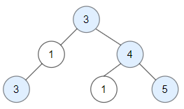
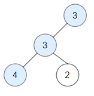

# [1448.Count Good Nodes in Binary Tree][title]

## Description
Given a binary tree `root`, a node X in the tree is named **good** if in the path from root to X there are no nodes with a value greater than X.

Return the number of **good** nodes in the binary tree.

**Example 1:**  


```
Input: root = [3,1,4,3,null,1,5]
Output: 4
Explanation: Nodes in blue are good.
Root Node (3) is always a good node.
Node 4 -> (3,4) is the maximum value in the path starting from the root.
Node 5 -> (3,4,5) is the maximum value in the path
Node 3 -> (3,1,3) is the maximum value in the path.
```

**Example 2:**  


```
Input: root = [3,3,null,4,2]
Output: 3
Explanation: Node 2 -> (3, 3, 2) is not good, because "3" is higher than it.
```

**Example 3:**

```
Input: root = [1]
Output: 1
Explanation: Root is considered as good.
```

## 结语

如果你同我一样热爱数据结构、算法、LeetCode，可以关注我 GitHub 上的 LeetCode 题解：[awesome-golang-algorithm][me]

[title]: https://leetcode.com/problems/count-good-nodes-in-binary-tree/
[me]: https://github.com/Golang-Solutions/awesome-golang-algorithm
