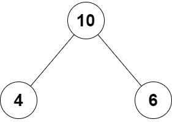

# [2236.Root Equals Sum of Children][title]

## Description
You are given the `root` of a **binary tree** that consists of exactly `3` nodes: the root, its left child, and its right child.

Return `true` if the value of the root is equal to the **sum** of the values of its two children, or `false` otherwise.

**Example 1:**  


```
Input: root = [10,4,6]
Output: true
Explanation: The values of the root, its left child, and its right child are 10, 4, and 6, respectively.
10 is equal to 4 + 6, so we return true.
```

**Example 2:**  

```
Input: root = [5,3,1]
Output: false
Explanation: The values of the root, its left child, and its right child are 5, 3, and 1, respectively.
5 is not equal to 3 + 1, so we return false.
```

## 结语

如果你同我一样热爱数据结构、算法、LeetCode，可以关注我 GitHub 上的 LeetCode 题解：[awesome-golang-algorithm][me]

[title]: https://leetcode.com/problems/root-equals-sum-of-children/
[me]: https://github.com/kylesliu/awesome-golang-algorithm
