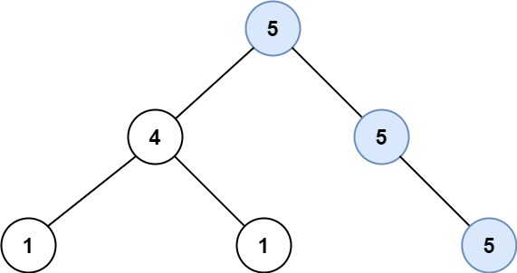

# [687.Longest Univalue Path][title]

## Description
Given the `root` of a binary tree, return the length of the longest path, where each node in the path has the same value. This path may or may not pass through the root.

**The length of the path** between two nodes is represented by the number of edges between them.

**Example 1:**  


```
Input: root = [5,4,5,1,1,null,5]
Output: 2
Explanation: The shown image shows that the longest path of the same value (i.e. 5).
```

**Example 2:**  


```
Input: root = [1,4,5,4,4,null,5]
Output: 2
Explanation: The shown image shows that the longest path of the same value (i.e. 4).
```

## 结语

如果你同我一样热爱数据结构、算法、LeetCode，可以关注我 GitHub 上的 LeetCode 题解：[awesome-golang-algorithm][me]

[title]: https://leetcode.com/problems/longest-univalue-path/
[me]: https://github.com/Golang-Solutions/awesome-golang-algorithm
